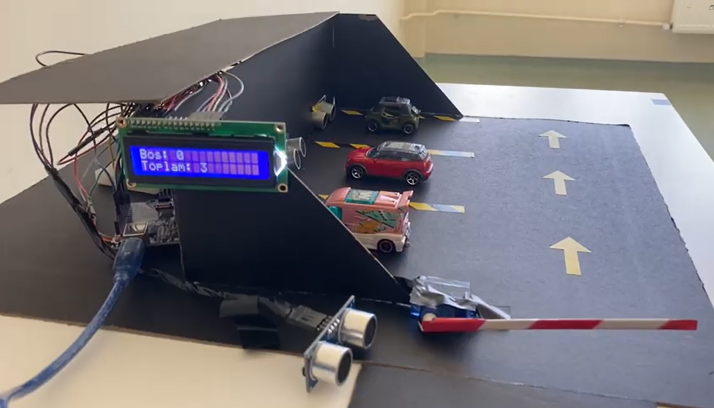
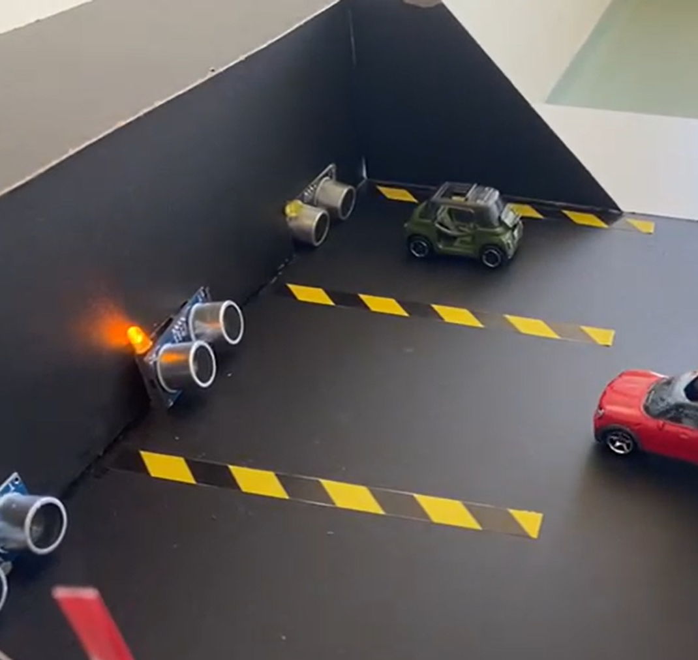
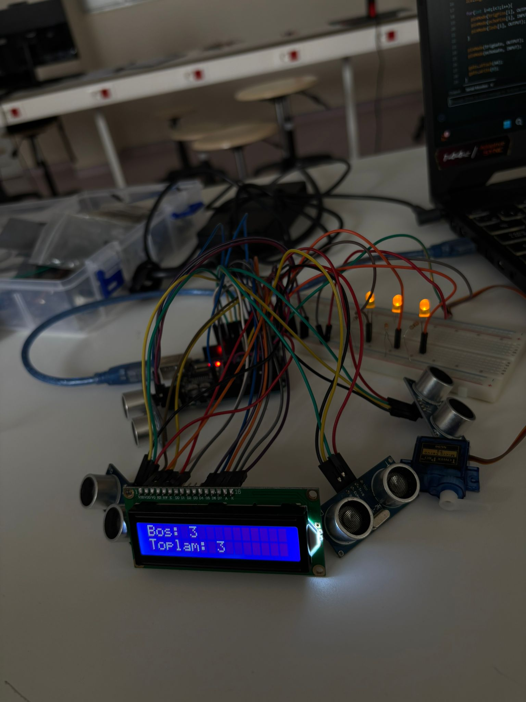

# arduino-akilli-otopark-sistemi

Bu proje, Arduino kullanılarak geliştirilmiş bir **akıllı otopark doluluk tespit sistemi**dir. Ultrasonik sensörler sayesinde park alanlarının dolu veya boş olup olmadığı tespit edilir ve LCD ekran ile kullanıcıya anlık bilgi verilir. Ayrıca giriş kapısı servo motor ile otomatik kontrol edilir.

---

## 📌 Projenin Amacı
Park alanlarını sensörler ile izleyerek:
- Boş park yerlerini göstermek
- Dolu/boş durumunu LED ile belirtmek
- Giriş kapısını otomatik kontrol etmek
- Kullanıcıya LCD ekran üzerinden bilgi vermek

---

## 🔧 Kullanılan Malzemeler
- Arduino Uno
- 16x2 LCD Ekran
- 4 adet Ultrasonik Sensör (HC-SR04)
- 3 adet LED
- Servo Motor
- Jumper kablolar
- Breadboard

---

## ⚙️ Çalışma Mantığı

- Her park yeri için bir ultrasonik sensör kullanılır.
- Mesafe 20 cm’den küçükse park yeri **dolu** kabul edilir.
- LED’ler park yerinin durumunu gösterir:
  - 🔴 Dolu → LED kapalı
  - 🟢 Boş → LED açık
- LCD ekranda:
  - Boş park sayısı gösterilir
  - Toplam kapasite yazdırılır
- Giriş kapısı sensörü:
  - Araç 10 cm altına geldiğinde servo motor kapıyı açar (90°)
  - Aksi halde kapalı kalır (0°)

---

## 💻 Kod Yapısı

- `LiquidCrystal` kütüphanesi LCD kontrolü için kullanıldı
- `Servo` kütüphanesi kapı kontrolü için kullanıldı
- `readDistance()` fonksiyonu tüm ultrasonik sensörlerden mesafe okumayı sağlar

---

## 📷 Proje Görselleri
